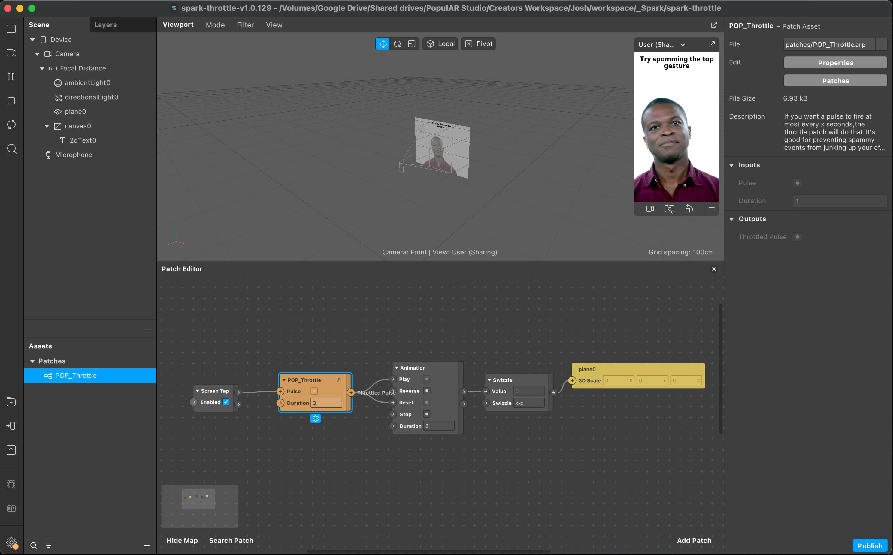

# Pulse Throttle for Spark AR

If you want a pulse to fire at most every x seconds, the throttle patch will do that. It's good for preventing spammy events from junking up your effect!

# POP_Throttle

## Inputs

Pulse: The pulse signal to throttle.

Duration: Seconds to throttle by.

## Outputs

Throttled pulse: The pulse with throttling applied